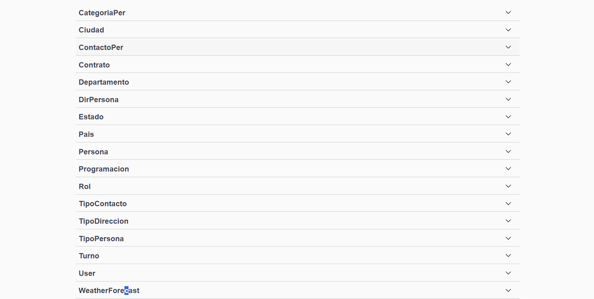
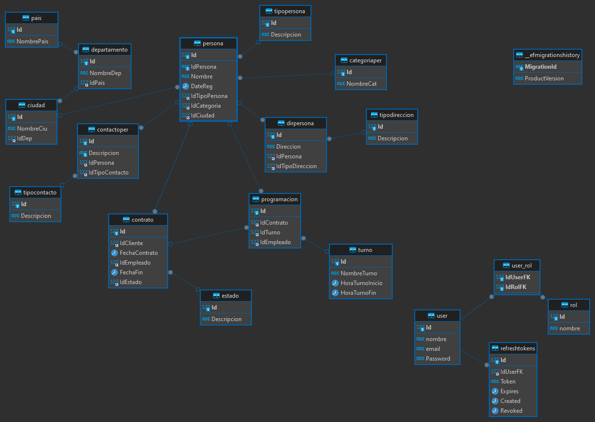
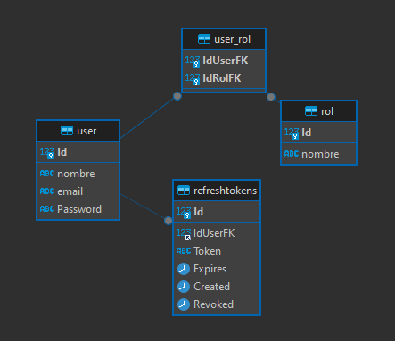
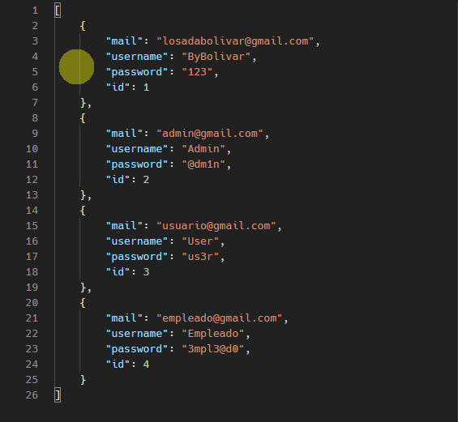
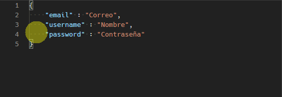
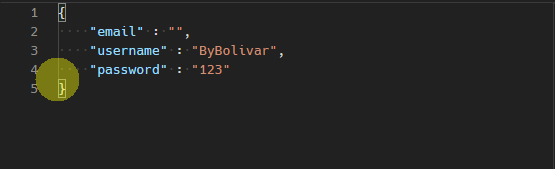
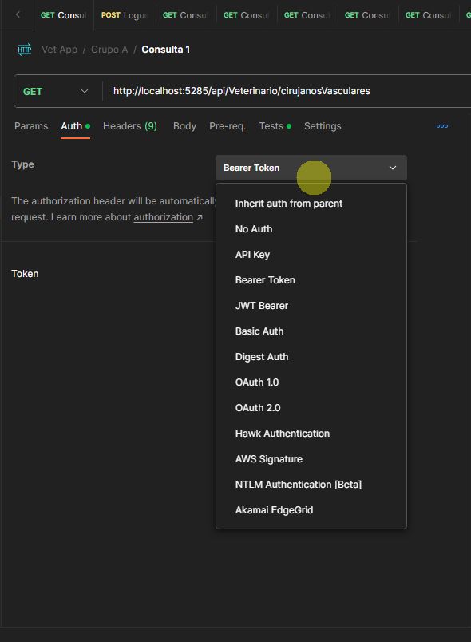
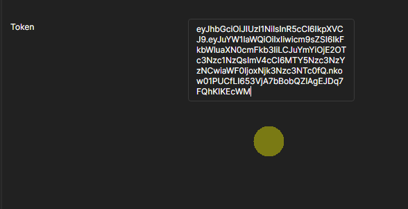
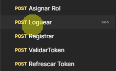

<h1 align="center"><b>Clay Security</b></h1>

<p>La empresa Clay Security dedicada a la prestacion de servicios de seguridad, esta interesada en desarrollar un backend que le permita integrar diferentes aplicaciones creadas por una empresa consultora de software, para el desarrollo de la prueba, la empresa le proporciona el DER de la base de datos elaborada por la empresa consultora!</p>

## Tecnologias 🧑🏻‍💻
<p align="center">
<br>

- **Back-End Development**: 
   
   

- **Frameworks, platforms & libraries**:
  

- **Softwares & Tools**: 
   
   
   
   
  

- **Database**:
  

</p>

<br>

## Requerimientos funcionales 👻<br>
🎯 Implementar control de acceso, usando JWT. ✔ <br>
🎯 Se debe prevenir peticiones automatizadas. ✔ <br>
🎯 Se debe implementar arquitectura DTO. ✔ <br>
🎯 Se debe implementar patron Singleton usando unidades de trabajo. ✔ <br>
🎯 Se debe implementar paginacion. ✔ <br>
🎯 Se debe generar CRUD. ✔ <br>

<br>

## Conteo de todas las consultas a realizar 📝
<details>
  <summary>Ver progreso de las consultas</summary>

### Consultas Totales: `Total 7/7` ✅ <br>

</details>

<br>

## Consultas requeridas 👨‍💻 <br>
 **Method**: `GET`

**🔰 Query 1: Listar todos los `empleados` de la `empresa de seguridad` ✅**: `http://localhost:5106/api/Empleado/ListarEmpleados`
```sql
    SELECT `p`.`Id` AS `IdEmpleado`, `p`.`IdPersona` AS `IdUnicoPersona`, `p`.`Nombre` AS `NombreDelEmpleado`, `t`.`Descripcion` AS `TipoDeEmpleado`, `p`.`IdCategoria`, `c`.`NombreCiu` AS `NombreCiudad`
    FROM `Persona` AS `p`
    INNER JOIN `TipoPersona` AS `t` ON `p`.`IdTipoPersona` = `t`.`Id`
    INNER JOIN `Ciudad` AS `c` ON `p`.`IdCiudad` = `c`.`Id`
    WHERE `t`.`Descripcion` = 'Empleado'

    public async Task<IEnumerable<object>> ListarEmpleados()
    {
        var mensaje = "listado de empleados de la empresa".ToUpper();

        var consulta = from c in _context.Personas
                       join e in _context.Tipopersonas on c.IdTipoPersona equals e.Id
                       join ci in _context.Ciudads on c.IdCiudad equals ci.Id
                       where e.Descripcion == "Empleado"
                       select new
                       {
                           IdEmpleado = c.Id,
                           IdUnicoPersona = c.IdPersona,
                           NombreDelEmpleado = c.Nombre,
                           TipoDeEmpleado = e.Descripcion,
                           IdCategoria = c.IdCategoria,
                           NombreCiudad = ci.NombreCiu,
                       };

        var resultado = await consulta.ToListAsync();

        var resultadoFinal = new List<object>
        {
            new { Msg = mensaje, DatosConsultados = resultado}
        };

        return resultadoFinal;
    }
```
**Method**: `GET`

**🔰 Query 2: Listar todos los `empleados` que son `vigilantes`. ✅**: `http://localhost:5106/api/Persona/EmpleadosVigilantes`
```sql
    SELECT `p`.`Id` AS `IdEmpleado`, `p`.`IdPersona` AS `IdUnicoPersona`, `p`.`Nombre` AS `NombreDelEmpleado`, `t`.`Descripcion` AS `TipoDeEmpleado`, `c0`.`NombreCat` AS `CategoriaDeEmpleado`, `c`.`NombreCiu` AS `NombreCiudad`
    FROM `Persona` AS `p`
    INNER JOIN `TipoPersona` AS `t` ON `p`.`IdTipoPersona` = `t`.`Id`
    INNER JOIN `Ciudad` AS `c` ON `p`.`IdCiudad` = `c`.`Id`
    INNER JOIN `CategoriaPer` AS `c0` ON `p`.`IdCategoria` = `c0`.`Id`
    WHERE (`t`.`Descripcion` = 'Empleado') AND (`c0`.`NombreCat` = 'Vigilante')

    public async Task<IEnumerable<object>> ListarEmpleadosVigilantes()
    {
        var mensaje = "listado de empleados que son vigilantes en la empresa".ToUpper();

        var consulta = from c in _context.Personas
                       join e in _context.Tipopersonas on c.IdTipoPersona equals e.Id
                       join ci in _context.Ciudads on c.IdCiudad equals ci.Id
                       join cp in _context.Categoriapers on c.IdCategoria equals cp.Id
                       where e.Descripcion == "Empleado" && cp.NombreCat == "Vigilante"
                       select new
                       {
                           IdEmpleado = c.Id,
                           IdUnicoPersona = c.IdPersona,
                           NombreDelEmpleado = c.Nombre,
                           TipoDeEmpleado = e.Descripcion,
                           CategoriaDeEmpleado = cp.NombreCat,
                           NombreCiudad = ci.NombreCiu,
                       };

        var resultado = await consulta.ToListAsync();

        var resultadoFinal = new List<object>
        {
            new { Msg = mensaje, DatosConsultados = resultado}
        };

        return resultadoFinal;
    }
```
**Method**: `GET`

**🔰 Query 3: Listar los `numeros de contacto` de un `empleado` que sea `vigilante`. ✅**: `http://localhost:5106/api/ContactoPer/ContactoEmpleadoVigilante`
```sql
    SELECT `p`.`Id` AS `IdEmpleado`, `p`.`Nombre` AS `NombreDelEmpleado`, `t`.`Descripcion` AS `TipoDeEmpleado`, `c1`.`NombreCat` AS `CategoriaDeEmpleado`, `c`.`Descripcion` AS `DescripcionContacto`, `c`.`IdTipoContacto` AS `TipoContacto`
      FROM `ContactoPer` AS `c`
      INNER JOIN `Persona` AS `p` ON `c`.`IdPersona` = `p`.`Id`
      INNER JOIN `TipoPersona` AS `t` ON `p`.`IdTipoPersona` = `t`.`Id`
      INNER JOIN `Ciudad` AS `c0` ON `p`.`IdCiudad` = `c0`.`Id`
      INNER JOIN `CategoriaPer` AS `c1` ON `p`.`IdCategoria` = `c1`.`Id`
      WHERE (`t`.`Descripcion` = 'Empleado') AND (`c1`.`NombreCat` = 'Vigilante')

    public async Task<IEnumerable<object>> ContactoEmpleadoVigilante()
    {
        var mensaje = "listado de los contactos de los empleados que son vigilantes en la empresa".ToUpper();

        var consulta = from c in _context.Contactopers
                       join emp in _context.Personas on c.IdPersona equals emp.Id
                       join e in _context.Tipopersonas on emp.IdTipoPersona equals e.Id
                       join ci in _context.Ciudads on emp.IdCiudad equals ci.Id
                       join cp in _context.Categoriapers on emp.IdCategoria equals cp.Id
                       where e.Descripcion == "Empleado" && cp.NombreCat == "Vigilante"
                       select new
                       {
                           IdEmpleado = emp.Id,
                           NombreDelEmpleado = emp.Nombre,
                           TipoDeEmpleado = e.Descripcion,
                           CategoriaDeEmpleado = cp.NombreCat,
                           DescripcionContacto = c.Descripcion,
                           TipoContacto = c.IdTipoContacto
                       };

        var resultado = await consulta.ToListAsync();

        var resultadoFinal = new List<object>
        {
            new { Msg = mensaje, DatosConsultados = resultado}
        };

        return resultadoFinal;
    }
```
**Method**: `GET`

**🔰 Query 4: Listar todos los `clientes` que vivan en la ciudad de `Bucaramanga`. ✅**: `http://localhost:5106/api/Persona/ClientesQueVivenEnBucaramanga`
```sql
    SELECT `p`.`Id` AS `IdCliente`, `p`.`IdPersona` AS `IdUnicoPersona`, `p`.`Nombre` AS `NombreDelCliente`, `c`.`NombreCiu` AS `NombreCiudad`
      FROM `Persona` AS `p`
      INNER JOIN `TipoPersona` AS `t` ON `p`.`IdTipoPersona` = `t`.`Id`
      INNER JOIN `Ciudad` AS `c` ON `p`.`IdCiudad` = `c`.`Id`
      WHERE (`t`.`Descripcion` = 'Cliente') AND (`c`.`NombreCiu` = 'Bucaramanga')

    public async Task<IEnumerable<object>> ClientesQueVivenEnBucaramanga()
    {
        var mensaje = "listado de clientes que viven en Bucaramanga".ToUpper();

        var consulta = from c in _context.Personas
                       join e in _context.Tipopersonas on c.IdTipoPersona equals e.Id
                       join ci in _context.Ciudads on c.IdCiudad equals ci.Id
                       where e.Descripcion == "Cliente" && ci.NombreCiu == "Bucaramanga"
                       select new
                       {
                           IdCliente = c.Id,
                           IdUnicoPersona = c.IdPersona,
                           NombreDelCliente = c.Nombre,
                           NombreCiudad = ci.NombreCiu,
                       };

        var resultado = await consulta.ToListAsync();

        var resultadoFinal = new List<object>
        {
            new { Msg = mensaje, DatosConsultados = resultado}
        };

        return resultadoFinal;
    }
```
**Method**: `GET`

**🔰 Query 5: Listar todos los `empleados` que vivan en `Giron` y `Piedecuesta`. ✅**: `http://localhost:5106/api/Persona/EmpleadosQueVivenEnGiron&Piedecuesta`
```sql


    public async Task<IEnumerable<object>> EmpleadosQueVivenEnGironYPiedecuesta()
    {
        var mensaje = "listado de clientes que viven en Bucaramanga".ToUpper();

        var consulta = from c in _context.Personas
                       join e in _context.Tipopersonas on c.IdTipoPersona equals e.Id
                       join ci in _context.Ciudads on c.IdCiudad equals ci.Id
                       join cp in _context.Categoriapers on c.IdCategoria equals cp.Id
                       where e.Descripcion == "Empleado" && ci.NombreCiu == "Giron" || ci.NombreCiu == "Piedecuesta"
                       select new
                       {
                           IdEmpleado = c.Id,
                           IdUnicoPersona = c.IdPersona,
                           NombreDelEmpleado = c.Nombre,
                           TipoDeEmpleado = e.Descripcion,
                           CategoriaDeEmpleado = cp.NombreCat,
                           NombreCiudad = ci.NombreCiu,
                       };

        var resultado = await consulta.ToListAsync();

        var resultadoFinal = new List<object>
        {
            new { Msg = mensaje, DatosConsultados = resultado}
        };

        return resultadoFinal;
    }
```
**Method**: `GET`

**🔰 Query 6: Listar todos los `clientes` que tengan `mas de 5 años de antiguedad`. ✅**: `http://localhost:5106/api/Persona/ClientesCon5AñosDeAntiguedad`
```sql
    SELECT `c`.`Id`, `c`.`FechaContrato`, `c`.`FechaFin`, `c`.`IdCliente`, `c`.`IdEmpleado`, `c`.`IdEstado`, `p`.`Id`, `p`.`DateReg`, `p`.`IdCategoria`, `p`.`IdCiudad`, `p`.`IdPersona`, `p`.`IdTipoPersona`, `p`.`Nombre`, `t`.`Id`, `t`.`Descripcion`
      FROM `Contrato` AS `c`
      INNER JOIN `Persona` AS `p` ON `c`.`IdCliente` = `p`.`Id`
      INNER JOIN `TipoPersona` AS `t` ON `p`.`IdTipoPersona` = `t`.`Id`
      WHERE `t`.`Descripcion` = 'Cliente'

    public async Task<IEnumerable<object>> ClientesCon5AñosDeAntiguedad()
    {
        var mensaje = "listado de clientes que tienen 5 años de antigüedad".ToUpper();

        var consulta = from c in _context.Contratos
                       join emp in _context.Personas on c.IdCliente equals emp.Id
                       join e in _context.Tipopersonas on emp.IdTipoPersona equals e.Id
                       where e.Descripcion == "Cliente"
                       select new
                       {
                           Contrato = c,
                           Persona = emp,
                           TipoPersona = e
                       };

        var result = await consulta.ToListAsync();

        var filteredResult = result
            .Where(ti => ti.TipoPersona.Descripcion == "Cliente" && ti.Contrato.FechaContrato.HasValue)
            .AsEnumerable()
            .Where(ti => (DateTime.Now - ti.Contrato.FechaContrato.Value.ToDateTime(TimeOnly.MinValue)).TotalDays / 365.25 >= 5)
            .Select(ti => new
            {
                IdCliente = ti.Persona.Id,
                IdUnicoPersona = ti.Persona.IdPersona,
                NombreDelCliente = ti.Persona.Nombre
            })
            .ToList();

        var resultadoFinal = new List<object>
    {
        new { Msg = mensaje, DatosConsultados = filteredResult }
    };

        return resultadoFinal;
    }
```
**Method**: `GET`

**🔰 Query 7: Listar todos los `contratos` cuyo estado es `activo`. Se debe mostrar el `Nro de contrato`, el `nombre del cliente` y el `empleado que registro el contrato`. ✅**: `http://localhost:5106/api/Contrato/ContratosActivos`
```sql
    SELECT `c`.`Id` AS `NroContracto`, `p0`.`Nombre` AS `NombreDelCliente`, `p`.`Nombre` AS `NombreDelEmpleado`
      FROM `Contrato` AS `c`
      INNER JOIN `Persona` AS `p` ON `c`.`IdEmpleado` = `p`.`Id`
      INNER JOIN `Persona` AS `p0` ON `c`.`IdCliente` = `p0`.`Id`
      INNER JOIN `Estado` AS `e` ON `c`.`IdEstado` = `e`.`Id`
      WHERE `e`.`Descripcion` = 'Activo'

    public async Task<IEnumerable<object>> ContratosActivos()
    {
        var mensaje = "listado de contratos que se encuentran activos".ToUpper();

        var consulta = from c in _context.Contratos
                       join emp in _context.Personas on c.IdEmpleado equals emp.Id
                       join cus in _context.Personas on c.IdCliente equals cus.Id
                       join et in _context.Estados on c.IdEstado equals et.Id
                       where et.Descripcion == "Activo"
                       select new
                       {
                           NroContracto = c.Id,
                           NombreDelCliente = cus.Nombre,
                           NombreDelEmpleado = emp.Nombre
                       };

        var resultado = await consulta.ToListAsync();

        var resultadoFinal = new List<object>
        {
            new { Msg = mensaje, DatosConsultados = resultado}
        };

        return resultadoFinal;
    }
```

<br>

## Preview project 👀
### 1. Controllers:


### 2. Diagram-Database: Clay Security:


### 3. Diagram-Tables JWT: User-Rol-RefreshToken:


<h4>Pasos a Seguir:</h4>
<p>Usuarios por defecto</p>
<br>

<p>Registro de usuario</p>
<br>

<p>Loguearse para obtener Token</p>
<br>

<p>Consultas resguardas por tipo de autenticacion con Bearer Token</p>
<br>

<p>Ingreso de Token</p>
<br>

<p>Consultas especiales de Usuarios & Roles</p>
<br>

## Authors and collaborators:
- Powered by <a href="https://github.com/IgmarLozadaBolivar">Igmar Lozada</a><br>

<br>

## Thank you for reading this documentation and that you have observed this interesting project!

<br>
